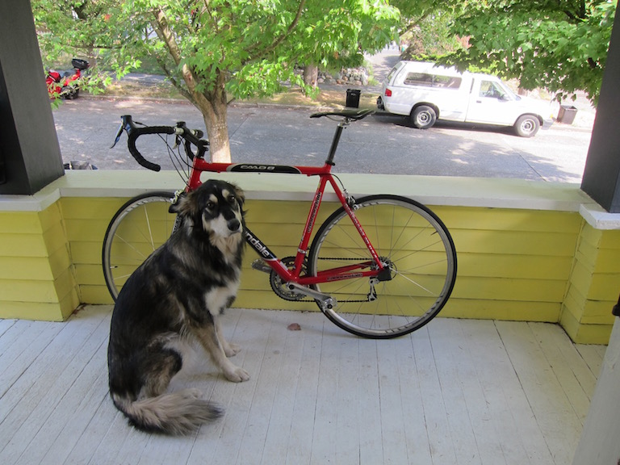
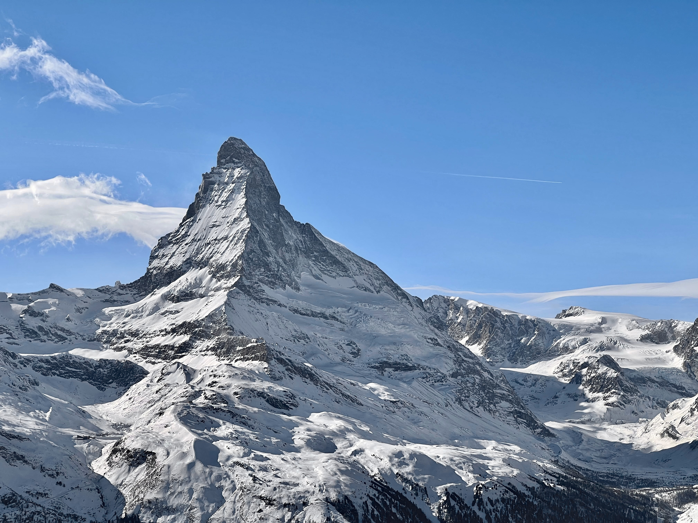
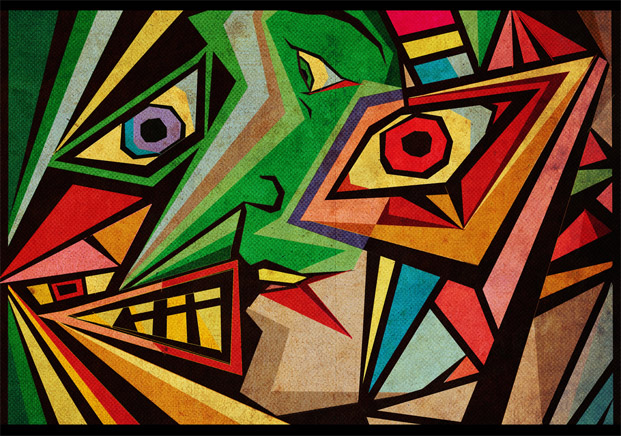
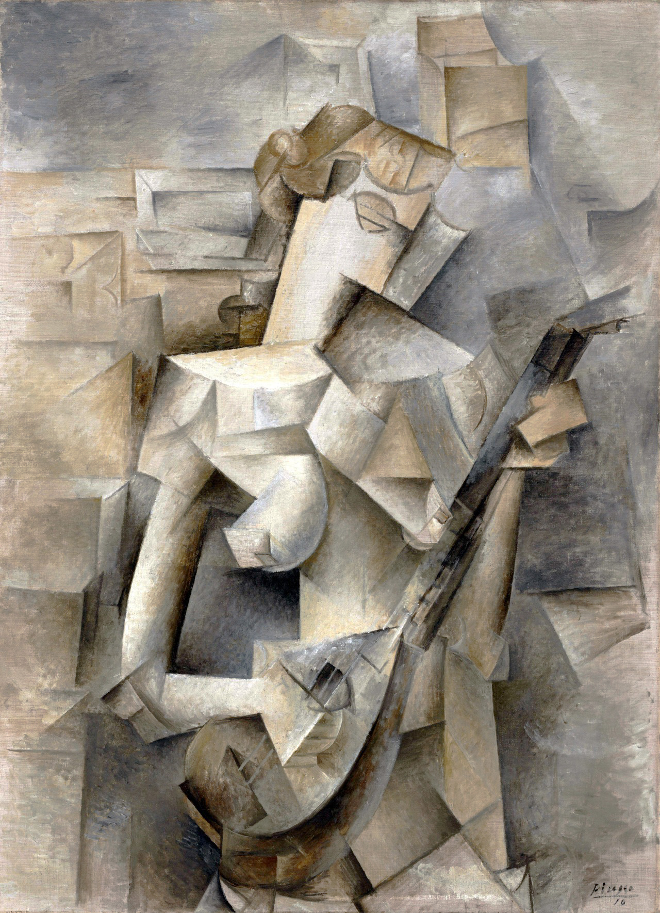
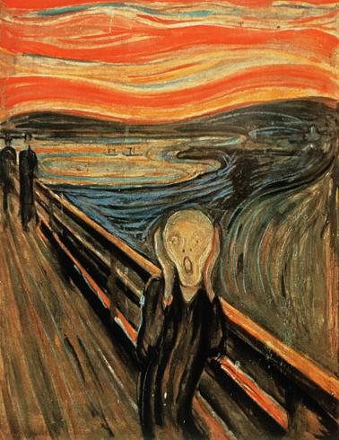
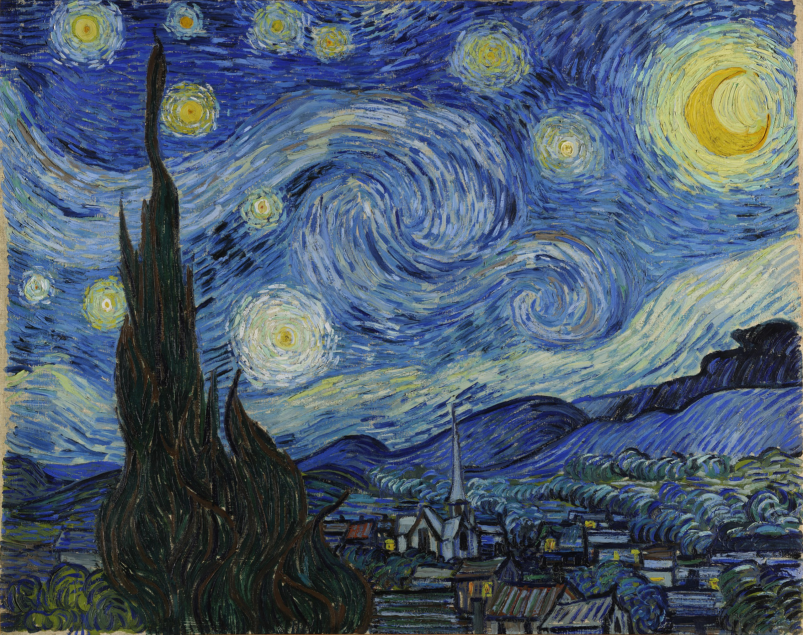
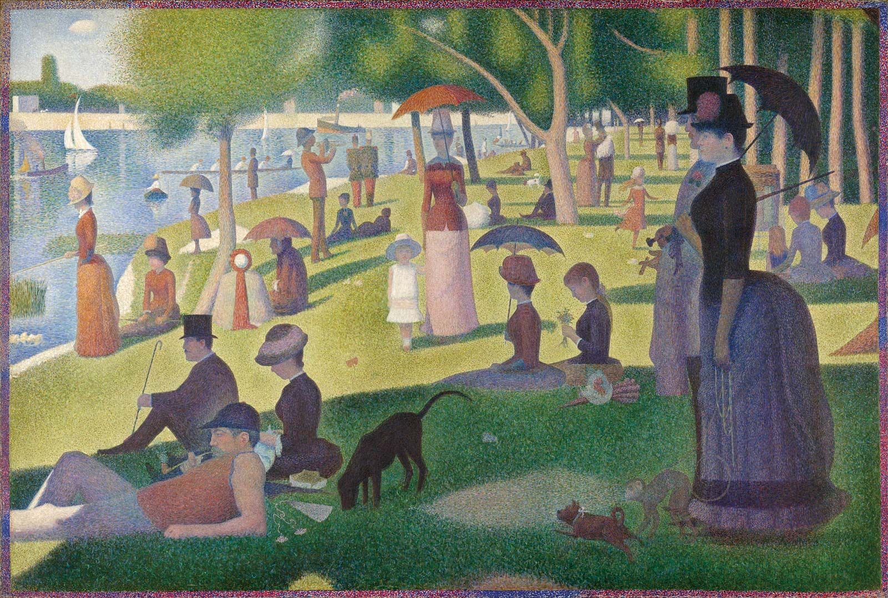
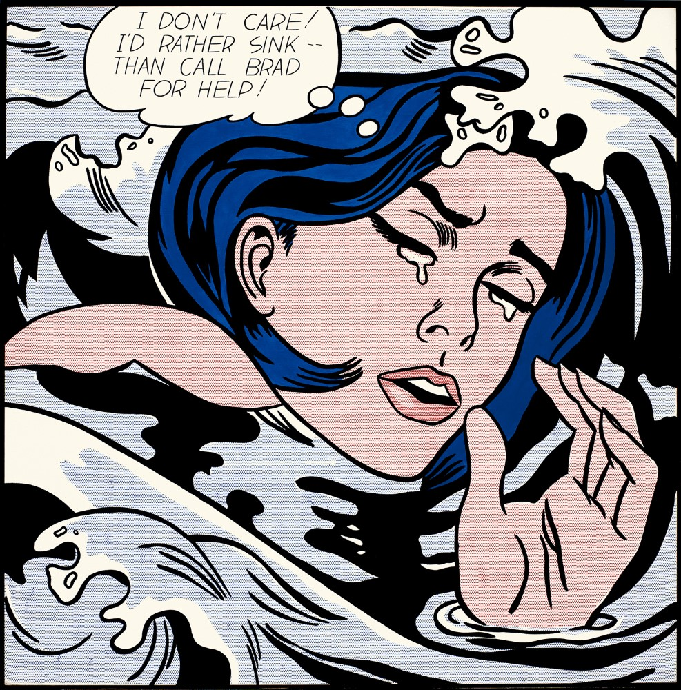

# Neural Style Transfer

## Project Video

My project video can be found [here](https://youtu.be/dqORtU96LHg). Please note that it is private and can be viewed only by those logged in with a uw.edu account.

## Problem description

The problem addressed in this project is neural style transfer, which involves transferring the artistic style of one image (the style image) onto the content of another image (the content image) while preserving the underlying structure and content of the latter.

## Previous work (including what you used for your method i.e. pretrained models)

The foundation of this project is based on [this paper by Gatys et al. (2015)](https://arxiv.org/pdf/1508.06576.pdf). The authors proposed a method that uses pre-trained convolutional neural networks (CNNs) to extract both the style and content information from images. Specifically, they used the VGG network architecture, pretrained on the ImageNet dataset, to capture high-level image features.

In my project, I utilized both the VGG-16 and VGG-19 architecture from Tensorflow Keras.

## Your approach

As I mentioned above, the approach employed in this project follows the basic methodology outlined by Gatys et al.

Based on my understanding of neural style transfer, my approach can be broadly broken down into the following steps:

1. Preprocessing:
    * Load the content image and the style image.
    * Preprocess images.
    * Convert the images into a format that can be processed by a neural network (e.g., tensors).
2. Building the Neural Network:
    * Use a pre-trained convolutional neural network (CNN), such as VGG, as the base network.
    * Remove the fully connected layers of the network since we only need the convolutional layers.
    * Define two separate loss functions: the content loss and the style loss.
3. Computing the Content Loss:
    * Pass the content image through the network to obtain its feature maps.
    * Choose a specific layer in the network to extract the content features.
    * Compute the content loss by comparing the feature maps of the generated image and the content image.
    * This loss encourages the generated image to retain the subject matter of the content image.
4. Computing the Style Loss:
    * Pass the style image through the network to obtain its feature maps.
    * Choose multiple layers in the network to extract the style features.
    * Compute the style loss by comparing the Gram matrices of the generated image and the style image at each selected layer.
    * The Gram matrix represents the correlations between different feature maps and captures the style information.
5. Total Loss and Optimization:
    * Define a total loss by combining the content loss and the style loss, usually with different weighting factors. (In this project, I also included a variation weight).
    * Minimize the total loss using an optimization algorithm (e.g., Adam).
    * Update the generated image iteratively to minimize the total loss.
    * The optimization process adjusts the generated image to match the content and style simultaneously.
6. Postprocessing:
    * Once the optimization process is complete, obtain the final generated image.
    * Convert the tensor back into a standard image format.
    * Save the generated image, which should blend the content and style of the input images.

I separated my code into 3 Python files - `main.py`, `style_transfer.py`, and `utils.py`. The file `main.py` contains the code that loads the pre-trained CNN models, defines the values for the important variables, executes the neural style transfer process written in `style_transfer.py`. The file `style_transfer.py` contains the main function for performing the neural style transfer process. It builds the model architecture, calculates loss and gradients, and iteratively modifies the generated image. The file `utils.py` contains the utility functions that are used by the style transfer process. For example, the functions for loading, preprocessing, and saving images, as well as computing loss functions are in this file.

## Datasets

Regarding the dataset, I utilized a pre-trained convolutional neural network (CNN) for this project, which eliminated the need to download or utilize any large dataset.

The CNN models employed in this project were pre-trained on ImageNet, a substantial visual database widely employed in research on visual object recognition software.

For the style transfer experiments, I used three distinct content images: the dog photograph we have used throughout this course, a photograph I took of the Matterhorn, and the official portrait of Barack Obama. They are shown below.

||||
| --- | --- | --- |
|    dog |     Matterhorn |    Barack Obama |

As for the style images, I used the following 6 paintings. The first painting is a Picasso. Unfortunately I could not find its name, even using Google's reverse image search. I felt that these 6 images captured a variety of artistic styles that were famous and distinct such as Expressionism, post-Impressionalism, and even Pop Art.

||||
| --- | --- | --- |
|    Unknown by Pablo Picasso |    "Girl with a Mandolin" by Pablo Picasso |    "The Scream" by Edvard Munch | 
|    "The Starry Night" by Vincent van Gogh |    "A Sunday on La Grande Jatte" by Georges Seurat |    "Drowning Girl" by Roy Lichtenstein |

## Results

Below are the results of this project.

### VGG-16 Model

| | dog | Matterhorn | Obama |
| --- | --- | --- | --- |
| Unknown Picasso | |  | |

### VGG-19 Model

| | dog | Matterhorn | Obama |
| --- | --- | --- | --- |
| Unknown Picasso | |  | 

### VGG-16 Model

| | dog | Matterhorn | Obama |
| --- | --- | --- | --- |
| Girl with a Mandolin | |  | 

### VGG-19 Model

| | dog | Matterhorn | Obama |
| --- | --- | --- | --- |
| Girl with a Mandolin | |  | 

### VGG-16 Model

| | dog | Matterhorn | Obama |
| --- | --- | --- | --- |
| The Scream | |  | 

### VGG-19 Model

| | dog | Matterhorn | Obama |
| --- | --- | --- | --- |
| The Scream | |  | 

### VGG-16 Model

| | dog | Matterhorn | Obama |
| --- | --- | --- | --- |
| The Starry Night | |  | 

### VGG-19 Model

| | dog | Matterhorn | Obama |
| --- | --- | --- | --- |
| The Starry Night | |  | 

### VGG-16 Model

| | dog | Matterhorn | Obama |
| --- | --- | --- | --- |
| A Sunday on La Grande Jatte | |  | 

### VGG-19 Model

| | dog | Matterhorn | Obama |
| --- | --- | --- | --- |
| A Sunday on La Grande Jatte | |  | 

### VGG-16 Model

| | dog | Matterhorn | Obama |
| --- | --- | --- | --- |
| Drowning Girl | |  | 

### VGG-19 Model

| | dog | Matterhorn | Obama |
| --- | --- | --- | --- |
| Drowning Girl | |  | 

### Observations

I was particularly happy with the images in the style of the unknown Picasso painting with VGG-16, as well as the images in the style of the "Girl with a Mandolin" with VGG-19.

Something interesting I noticed is that the VGG-16 model appears to simply replaceme low-frequency areas in the content image with the style image, rather than truely integrating the style into the content image. This phenomenon is particularly noticeable in the lower right corner of variations of the dog image, as well as in the bottom left and upper right corners of the Matterhorn image. This is also noticeable in the lower right areas of the portrait of Obama. Interestingly the images styled with the unknown Picasso painting did not seem to exhibit this issue to a significant extent.

It is worth noting that achieving higher-resolution images would really help this evaluation process. The current low resolution outputs introduces difficulty in accurately assessing the presence of noise. It's hard to determine if the artifacts stem solely from the image's low resolution or the variation weight is simply too low. I explain below why I was forced to output small low-resolution images.

## Discussion

### What problems did you encounter?

The main problem I consistently encountered throughout this project was running out of system memory, resulting in my laptop shutting down and rebooting. If the input or output images were too big, my laptop would freeze and shut down. Similarly, running neural networks other than the VGG architectures would trigger the same outcome. Consequently, the output images are considerably small. This is because I resorted to resizing the input images to prevent system freezes and shutdowns.

Although there may be smart memory management techniques in Python, such as well placed `del` statements, I have yet to discover and implement them effectively. This was my very first experience working with deep learning libraries, so I acknowledge the need for further practice and familiarization.

### Are there next steps you would take if you kept working on the project?

There are several aspects I would address if I were to continue working on this project.

Firstly, I would like to review my code, preferably with somebody knowledgable about this topic, to ensure the accuracy of the mathematical calculations and conceptual aspects. This would also be helpful to identify and fix any minor bugs. For example, the difference in color intensity between the output images styled after the unknown Picasso painting and the original painting itself raises some concerns for me.

Additionally, I would like to improve the memory efficiency of my code, as I frequently encounter memory issues. If I can better manage memory, then perhaps I could try neural style transfer with the other pre-trained CNN models.

Finally, I am interested in implementing more advanced techniques, such as Cycle Consistent Generative Adversarial Networks.

### How does your approach differ from others? Was that beneficial?

One novel aspect I incorporated was the inclusion of variation weight and variation loss in the total loss function. Although this particular element is not in the original paper by Gatys et. al., I noticed that several individuals online had included it in their implementations. The purpose of this addition to the loss function is to encourage spatial smoothness in the generated image. I would definitely say that this resulted in more visually appealing images with less noise.

 The second novel aspect I included my approach was using the VGG-16 architecture. Nearly all articles on neural style transfer online use the VGG-19 architecture. I decided to also use the VGG-16 model as it is more lightweight and thus has a smaller impact on memory. I also wanted if the results would be significantly worse. Unfortunately, as I mentioned above, I felt that the VGG-19 model was far better at spreading the "style" of an image around the content image rather than replacing low-frequency areas with the image. However, it is worth noting that I did not change the content and style layers associated with the VGG-16 model. Perhaps if I adjusted these, the outputs would be far better.

The final novel aspect I attempted was to use a variety of pre-trained CNNs for this project. I came across [this webpage](https://towardsdatascience.com/4-pre-trained-cnn-models-to-use-for-computer-vision-with-transfer-learning-885cb1b2dfc) which discussed alternative options for pretrained CNNs – InceptionV3, ResNet50, and EfficientNetB0. I decided to investigate their potential and compare their performance. These networks have different layer names, which required me to write some additional code to account for these variations. Regrettably, I continuously encountered system memory limitations that prevented me from fully performing neural style transfer using these alternative neural networks.

Incorporating many novel elements into this project proved to be challenging because a significant portion of my time was dedicated to simply making the original algorithm by Gatys et. al. work properly. Even now, I'm uncertain if my approach is entirely accurate, although the resulting images do appear to merge the content and style images to some extent.

One major reason for the lengthy process was that I wrote all of the code from scratch. That's not to say that my code looks completely different from others' code. I studied other people's implementations very closely. And Gatys et. al.'s paper is quite popular, and numerous individuals have recreated the algorithm described within it. Additionally, for nearly all mathematical operations, I used Tensorflow, which is a widely used deep learning library that I'm certain many other developers employed while coding for this project. However, I did not intentionally copy code from others.

## Sources

I read the following websites as I worked on the project.

[Neural Networks Intuitions: 2. Dot product, Gram Matrix and Neural Style Transfer by Raghul Asokan](https://towardsdatascience.com/neural-networks-intuitions-2-dot-product-gram-matrix-and-neural-style-transfer-5d39653e7916)

[Intuitive Guide to Neural Style Transfer by Thushan Ganegedara
](https://towardsdatascience.com/light-on-math-machine-learning-intuitive-guide-to-neural-style-transfer-ef88e46697ee)

[Neural Style Transfer using VGG model by Darshan Adakane](https://towardsdatascience.com/neural-style-transfer-using-vgg-model-ff0f9757aafc)

[Neural Style Transfer by Dive Into Deep Learning](https://d2l.ai/chapter_computer-vision/neural-style.html#preprocessing-and-postprocessing)

[Neural style transfer by TensorFlow](https://www.tensorflow.org/tutorials/generative/style_transfer)
