# Neural Style Transfer

A TensorFlow implementation of neural style transfer based on ["A Neural Algorithm of Artistic Style"](https://arxiv.org/pdf/1508.06576.pdf) by Gatys et al. (2015).

**Course:** CSE 455 - Computer Vision
**Institution:** University of Washington

## Overview

This project transfers the artistic style of one image onto the content of another while preserving the underlying structure. It uses pre-trained convolutional neural networks (VGG16/VGG19) to extract content and style features, then optimizes a generated image to minimize a combined loss function.

## Installation

```bash
# Clone the repository
git clone https://github.com/joshuaswanson/neural_style_transfer.git
cd neural_style_transfer

# Create a virtual environment (recommended)
python -m venv venv
source venv/bin/activate  # On Windows: venv\Scripts\activate

# Install dependencies
pip install -r requirements.txt
```

## Usage

```bash
python main.py
```

The script will process all images in the `contents/` directory with all styles from `styles/`, saving results to `output/`.

### Configuration

Key parameters can be adjusted in `main.py`:

| Parameter | Default | Description |
|-----------|---------|-------------|
| `alpha` | 5 | Content loss weight |
| `beta` | 1 | Style loss weight |
| `variation_weight` | 30 | Total variation loss weight (smoothness) |
| `num_iterations` | 1000 | Optimization iterations |

## Project Structure

```
neural_style_transfer/
├── main.py              # Entry point and model configuration
├── style_transfer.py    # Core optimization loop
├── utils.py             # Image I/O and loss functions
├── contents/            # Content images
├── styles/              # Style images
├── output/              # Generated results
├── requirements.txt     # Python dependencies
└── README.md
```

## Approach

The implementation follows the methodology outlined by Gatys et al.:

1. **Preprocessing:** Load and resize images, apply model-specific preprocessing
2. **Feature Extraction:** Use pre-trained VGG networks (without fully connected layers) to extract features
3. **Content Loss:** Compare feature maps at deep layers between content and generated images
4. **Style Loss:** Compare Gram matrices of feature maps at multiple layers between style and generated images
5. **Optimization:** Minimize total loss (content + style + variation) using Adam optimizer
6. **Postprocessing:** Reverse preprocessing and save the generated image

### Loss Function

The total loss combines three components:

- **Content Loss:** MSE between content and generated feature representations
- **Style Loss:** MSE between Gram matrices of style and generated feature maps
- **Variation Loss:** Total variation regularization for spatial smoothness (extension beyond original paper)

## Dataset

### Content Images

| | | |
|:---:|:---:|:---:|
|  |  |  |
| Dog | Matterhorn | Barack Obama |

### Style Images

| | | |
|:---:|:---:|:---:|
|  |  |  |
| Unknown (Picasso) | "Girl with a Mandolin" (Picasso) | "The Scream" (Munch) |
|  |  |  |
| "The Starry Night" (Van Gogh) | "A Sunday on La Grande Jatte" (Seurat) | "Drowning Girl" (Lichtenstein) |

## Results

### VGG-16 Results

| Style | Dog | Matterhorn | Obama |
|:------|:---:|:----------:|:-----:|
| Unknown Picasso | 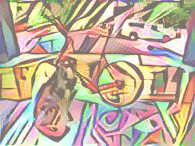 | 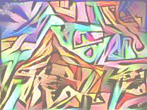 | 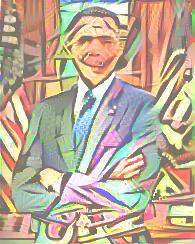 |
| Girl with a Mandolin | 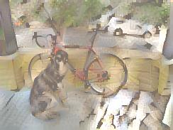 | 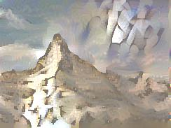 | 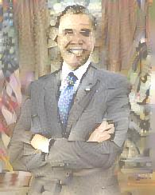 |
| The Scream | 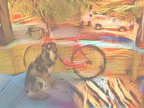 | 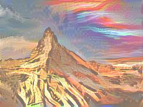 | 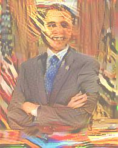 |
| The Starry Night | 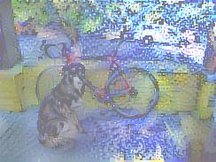 | 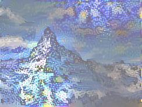 | 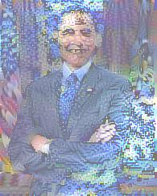 |
| A Sunday on La Grande Jatte | 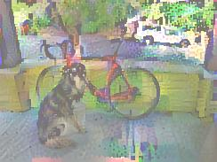 | 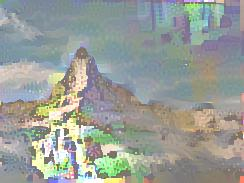 | 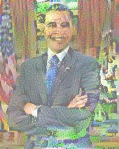 |
| Drowning Girl | 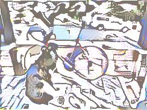 | 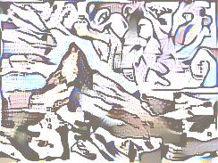 | 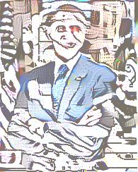 |

### VGG-19 Results

| Style | Dog | Matterhorn | Obama |
|:------|:---:|:----------:|:-----:|
| Unknown Picasso | 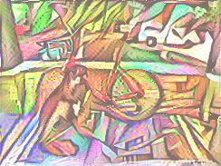 | 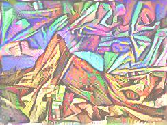 | 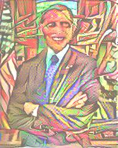 |
| Girl with a Mandolin | 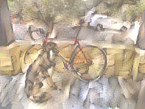 | 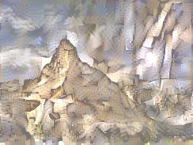 | 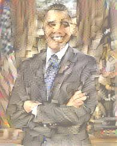 |
| The Scream | 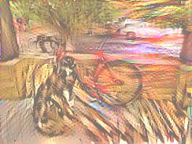 | 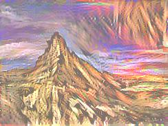 | 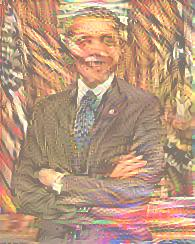 |
| The Starry Night | 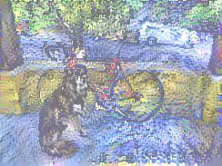 | 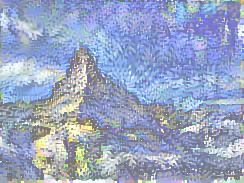 | 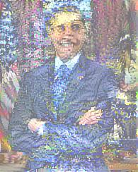 |
| A Sunday on La Grande Jatte | 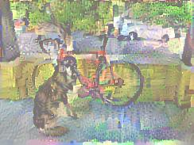 | 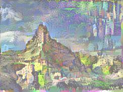 | 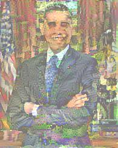 |
| Drowning Girl | 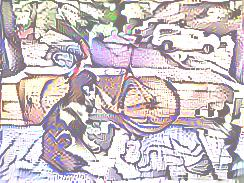 | 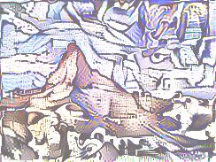 | 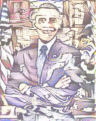 |

### Observations

- The unknown Picasso painting with VGG-16 and "Girl with a Mandolin" with VGG-19 produced particularly appealing results
- VGG-16 tends to replace low-frequency areas with the style image rather than truly integrating the style (noticeable in corners of dog and Matterhorn images)
- VGG-19 generally provides better style distribution across the entire image
- Higher resolution outputs would improve quality assessment, but memory constraints limited image dimensions

## Discussion

### Challenges

The primary challenge was memory management. Processing larger images or using alternative architectures (InceptionV3, ResNet50, EfficientNetB0) caused system memory exhaustion. Output images are consequently limited in resolution.

### Novel Contributions

1. **Variation Loss:** Added total variation regularization (not in original paper) to reduce high-frequency noise
2. **VGG-16 Comparison:** Most implementations use only VGG-19; this project compares both architectures
3. **Multi-Architecture Support:** Framework supports multiple CNN architectures (though memory limits practical use)

### Future Work

- Implement memory optimization techniques
- Experiment with different layer selections for VGG-16
- Explore Cycle-Consistent GANs for style transfer
- Add command-line argument support for hyperparameter tuning

## References

- [A Neural Algorithm of Artistic Style (Gatys et al., 2015)](https://arxiv.org/pdf/1508.06576.pdf)
- [Neural Networks Intuitions: Dot product, Gram Matrix and Neural Style Transfer](https://towardsdatascience.com/neural-networks-intuitions-2-dot-product-gram-matrix-and-neural-style-transfer-5d39653e7916)
- [Intuitive Guide to Neural Style Transfer](https://towardsdatascience.com/light-on-math-machine-learning-intuitive-guide-to-neural-style-transfer-ef88e46697ee)
- [Neural Style Transfer using VGG model](https://towardsdatascience.com/neural-style-transfer-using-vgg-model-ff0f9757aafc)
- [Neural Style Transfer - Dive Into Deep Learning](https://d2l.ai/chapter_computer-vision/neural-style.html)
- [Neural style transfer - TensorFlow Tutorial](https://www.tensorflow.org/tutorials/generative/style_transfer)
